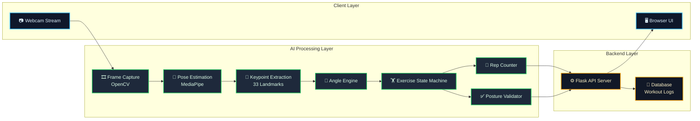
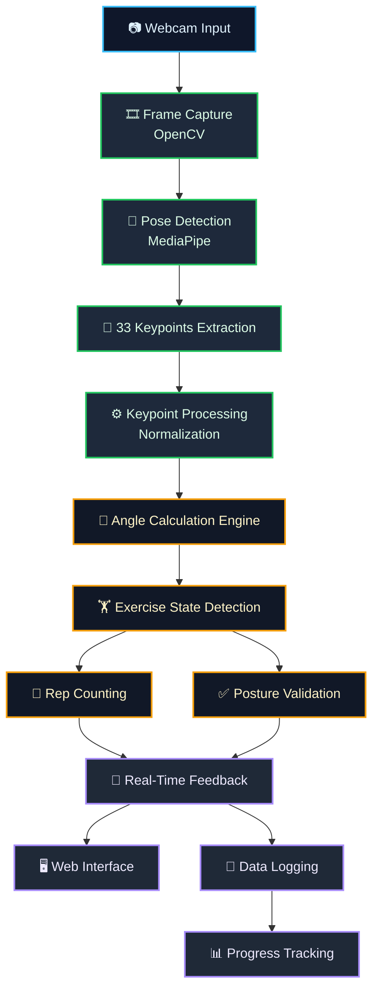

#  Fitness Trainer with Pose Estimation  

An AI-powered fitness coaching system that uses **real-time computer vision and pose estimation** to track exercises, correct posture, and deliver instant feedback, transforming a webcam into an intelligent personal trainer.

---

##  Key Highlights  

- Processes **500+ frames per minute** with real-time feedback  
- Achieves **~90%+ accuracy in repetition counting**  
- Detects **incorrect posture within <100 ms latency**  
- Supports **multi-exercise tracking with scalable architecture**  
- Designed as a **full pipeline: Vision → Logic → Feedback → Tracking**

---

## 🎯 Features  

- Real-time pose estimation using MediaPipe (33 body keypoints per frame)  
- Exercise tracking: Squats, Push-ups, Hammer Curls  
- Intelligent rep counting using angle-based biomechanics  
- Posture correction with instant feedback  
- Custom sets and repetition targets  
- Session-based progress tracking  
- Lightweight and accessible web interface  

---

## 🧩 System Architecture  



---

## ⚙️ Installation  

### 1. Clone the Repository  
```bash
git clone https://github.com/vidhiomar/Gym-AI-Trainer
cd Gym-AI-Trainer
2. Install Dependencies
pip install -r requirements.txt
3. Setup Static Assets
mkdir -p static/images
```


▶️ Usage
```
1. Start the Server
python app.py

2. Open in Browser
http://127.0.0.1:5000

3. Run a Workout
Select exercise type
Set reps and sets
Start workout
Position full body in frame
Follow real-time feedback
```
## 🧠 How It Works  

The system follows a real-time pipeline that converts video input into actionable fitness feedback.

### 1. Frame Capture  
- Captures live video stream using OpenCV  
- Processes frames at ~20–30 FPS for real-time performance  

### 2. Pose Estimation  
- Uses MediaPipe to detect **33 body landmarks per frame**  
- Converts human body movements into structured keypoint coordinates  

### 3. Keypoint Processing  
- Extracts relevant joints (shoulders, elbows, hips, knees)  
- Normalizes coordinates for consistent calculations  

### 4. Angle Calculation  
- Computes joint angles using three keypoints  
- Example: Shoulder–Elbow–Wrist → arm angle  

```python
angle = calculate_angle(pointA, pointB, pointC)

```
## 🔁 End-to-End Flow  



📄 License

This project is licensed under the MIT License.
